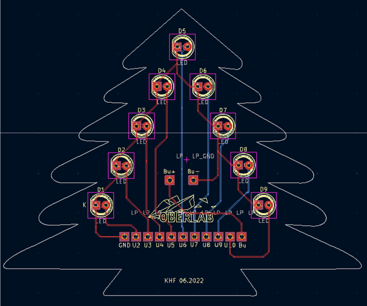
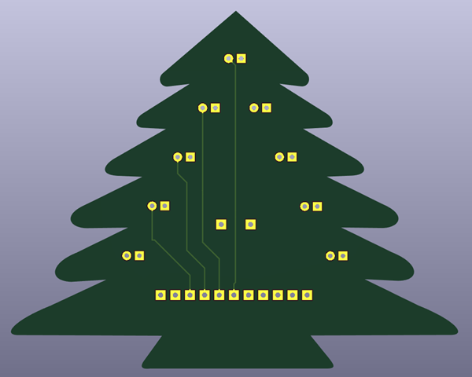
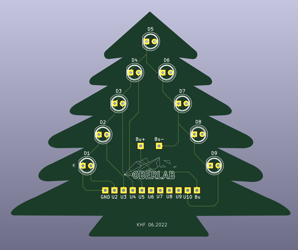

# KiCad_Weihnachtsbaum
Platine, NANO, LEDs und Jingle Bells Melodie

|[:skull:ISSUE](https://github.com/frankyhub/KiCad_Weihnachtsbaum/issues?q=is%3Aissue)|[:speech_balloon: Forum /Discussion](https://github.com/frankyhub/KiCad_Weihnachtsbaum/discussions)|[:grey_question:WiKi](https://github.com/frankyhub/KiCad_Weihnachtsbaum/wiki)||
|--|--|--|--|
| | | | |
||<a href="https://github.com/frankyhub/KiCad_Weihnachtsbaum/issues">|<a href="https://github.com/frankyhub/KiCad_Weihnachtsbaum/discussions">|<a href="https://github.com/frankyhub/KiCad_Weihnachtsbaum/releases">|
|| <a href="https://github.com/frankyhub/KiCad_Weihnachtsbaum/pulse" alt="Activity">| <a href="https://github.com/frankyhub/KiCad_Weihnachtsbaum/graphs/traffic">  |<a href="https://github.com/frankyhub?tab=stars"> |

## BOM

| Anzahl | Bezeichnung | 
| -------- | -------- | 
| 1  |  NANO Shield	  |
| 1  |  NANO |
|  1 |  Buzzer|  
| 9  |  R1	100  |
|  9 |  LED 5mm| 
|  1 | Batterieclip 9V	   |
| 1  | 9V Batterie   |
| -------- | -------- | 

---

   
<ol class="breadcrumb" style="border-top: 2px solid black;border-bottom:2px solid black; height: 45px; width: 900px;"> 
<a href="#oben">nach oben</a>
</ol>

  

---

